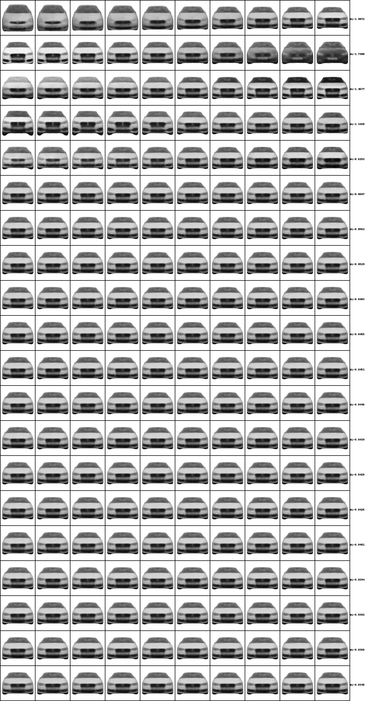

<p align="center"> </p>

## Market Structure Mapping with Visual Characteristics
Code to replicate results in, "Market Structure Mapping with Visual Characteristics."  

If you find this work useful, please use the following citation information in plaintext or BibTeX format:

Sisodia, A, Kumar, V and Burnap, A (2024). Market Structure Mapping with Visual Characteristics. To be submitted.

```
@article{sisodia2024marketstructure,
  title= Market Structure Mapping with Visual Characteristics},
  author={Sisodia, A, Kumar, V and Burnap, A},
  journal={To be submitted},
  volume={XXX},
  number={XXX},
  pages={XXX},
  year={2024},
  publisher={XXX}
}
```
This code will reproduce Figures and Tables of the paper.

## Installation
#### Libraries
This codebase was built using the Pytorch neural net framework.  However, it also depends on over 100 other Python packages, as well as GPU libraries including CUDA runtimes and cuDNN kernel support. We can not guarantee this code will run and replicate unless the same environment and library versions are used.  To install these packages (including the same library versions), please use the following:

    conda env create -f marketstructure_env.yml

#### Data
To download the dataset, please use the following link.

* #### [Cars Dataset](https://www.dropbox.com/scl/fi/hzo4w80lpiuunkxn2hc5a/cars_original.npz?rlkey=7mowfp6bs3q8w95m32bkzjtzp&dl=0)

Copy these files to `./disentanglement/categorical_disentanglement_hyper_selection/data/cars/`, `./disentanglement/one_disentanglement_hyper_selection/data/cars/`, `./disentanglement/three_disentanglement_hyper_selection/data/cars/`, and `./disentanglement/unsup_disentanglement_hyper_selection/data/cars/`.

## Replication Steps

#### Step 1: Run BLP Demand Model

1. Change directory to `./blp_before_disentanglement` and estimate the BLP demand model by executing `python pyblp_code.py` and `pyblp_code_pricehet.py`. [ **Table EC.1: Parameter Estimates of Model of Market Equilibrium** ]
2. Execute `Rscript helper_script.R` to produce `exp_python_image_table.csv`.
3. Move  `exp_python_image_table.csv` to `../disentanglement/dataset_creation`.

#### Step 2: Dataset Creation

1. Change directory to `./disentanglement/dataset_creation`.
2. Unzip `jpeg_files.zip`.
3. Remove `rm -rf  __MACOSX/`.
4. Move `mv jpeg_files/*jpg .`
5. Remove `rm -rf jpeg_files`
6. Execute `python npz_trainfile_creation.py`.
7. Remove `*jpg`.
8. Unzip `test_jpeg_files.zip`.
9. Remove `rm -rf  __MACOSX/`.
10. Move `mv test_jpeg_files/*jpg .`
11. Remove `rm -rf test_jpeg_files`
12. Execute `python npz_testfile_creation.py`.

#### Step 3: Grid Search for Hyperparamaters

1. Go to `./disentanglement/one_disentanglement_hyper_selection` and run disentanglement model with a unique $\lambda_1$, $\lambda_2$, and supervisory signal with 10 different seeds. Vary $\lambda_1$, $\lambda_2$, and supervisory signal combination. For example, in the below command, the seed is set to 1, $\lambda_1$=50, $\lambda_2$=20, and the supervisory signal is price. The model name is `price_s5b50m20`. 

```
python main.py --sup_signal1 price -s 5 --name price_s5b50m20 --btcvae-B 50 --btcvae-M 20
```

In the above command, seed, $\lambda_1$, and $\lambda_2$ is a scalar value. This codebase, specific to one supervisory signal, supports the following set of discrete supporting signals. Using any other name will result in an error.

```
ht
length
width
height
weight
wheelbase
price
xife
```

2. Go to `./disentanglement/categorical_disentanglement_hyper_selection` and run disentanglement model with a unique $\lambda_1$, $\lambda_2$, and supervisory signal with 10 different seeds. Vary $\lambda_1$, $\lambda_2$, and supervisory signal combination. For example, in the below command, the seed is set to 1, $\lambda_1$=50, $\lambda_2$=20, and the supervisory signal is make. The model name is `make_s5b50m20`. 

```
python main.py --sup_signal1 make -s 5 --name make_s5b50m20 --btcvae-B 50 --btcvae-M 20
```

In the above command, seed, $\lambda_1$, and $\lambda_2$ is a scalar value. This codebase, specific to one supervisory signal, supports the following set of discrete supporting signals. Using any other name will result in an error.

```
make
color (coded for segment)
region
```

3. Go to `./disentanglement/three_disentanglement_hyper_selection/` and run disentanglement model with a unique $\lambda_1$, and $\lambda_2$ with 10 different seeds. Vary $\lambda_1$, and $\lambda_2$. For example, in the below command, the seed is set to 1, $\lambda_1$=50, $\lambda_2$=20. 

, and the supervisory signal is a comboination of hpwt, mpg and space. The model name is `hpwt_mpg_space_s5b50m20`.

```
python main.py -s 5 --sup_signal1 hpwt --sup_signal2 mpg --sup_signal3 space --name hpwt_mpg_space_s5b50m20 --btcvae-B 50 --btcvae-M 20
```

This codebase, specific to a combination of three supervisory signal, supports the following set of discrete supporting signals. Using any other name will result in an error.

```
hpwt_mpg_space
length_wid_ht
wb_wid_ht
```

4. Go to `./disentanglement/unsup_disentanglement_hyper_selection/` and run disentanglement model with a unique $\lambda_1$ with 10 different seeds. Vary $\lambda_1$ alone. For example, in the below command, the seed is set to 1, $\lambda_1$=50, $\lambda_2$=0.

```
python main.py -s 5 --name unsup_s5b50m0 --btcvae-B 50 --btcvae-M 0
```

In the above command, seed, $\lambda_1$ is a scalar value and $\lambda_2$ is fixed at 0. This codebase is specific to no supervisory signals.

All the python commands will create a directory `results/<model-name>/` which will contain:

* **model.pt**: The model at the end of training.
* **specs.json**: The parameters used to run the program (default and modified with CLI).
* **train_losses.csv**: All (sub-)losses computed during training on the train and validation dataset.
* **test_losses.log**: All (sub-)losses computed at the end of training on the test1 and test2 dataset. 
* **filename_test1.csv**: filenames of all watches in the test1 dataset. 
* **filename_test2.csv**: filenames of all watches in the test2 dataset. 
* **filename_train.csv**: filenames of all watches in the train dataset. 
* **mean_params_test1.csv**: mean visual characteristics of all cars in the test1 dataset. 
* **mean_params_test2.csv**: mean visual characteristics of all cars in the test2 dataset. 
* **mean_params_train.csv**: mean visual characteristics of all cars in the train dataset. 

#### Step 4: Model Selection & UDR Calculation

Select the value of $\lambda_1$ and $\lambda_2$ for each supervisory signal at which the average supervised loss across 10 seeds on the test1 dataset is lowest. 

1. Go to `./disentanglement/categorical_model_selection/results` and execute `./mv_script.sh`.
2. Go to `./disentanglement/one_disentanglement_hyper_selection/results` and execute `./mv_script.sh`.
3. Go to `./disentanglement/three_disentanglement_hyper_selection/results` and execute `./mv_script.sh`.
4. Go to `./disentanglement/unsup_disentanglement_hyper_selection/results` and execute `./mv_script.sh`.
5. Go to `./disentanglement/categorical_model_selection` and execute `cp ../categorical_disentanglement_hyper_selection/results/*/*csv .`.
6. Go to `./disentanglement/one_model_selection` and execute `cp ../one_disentanglement_hyper_selection/results/*/*csv .`.
7. Go to `./disentanglement/three_model_selection` and execute `cp ../three_disentanglement_hyper_selection/results/*/*csv .`.
8. Go to `./disentanglement/unsup_model_selection` and execute `cp ../unsup_disentanglement_hyper_selection/results/*/*csv .`.
9. Go to `./disentanglement/categorical_model_selection` and execute `Rscript val_loss.R make`, `Rscript val_loss.R color`, and `Rscript val_loss.R region` to find the optimal hyperparameters for a particular supervisory signal.
10. Go to `./disentanglement/one_model_selection` and execute `Rscript val_loss.R ht`, `Rscript val_loss.R length`, `Rscript val_loss.R price`, `Rscript val_loss.R wb`, `Rscript val_loss.R wid`, `Rscript val_loss.R wt`, and `Rscript val_loss.R xife` to find the optimal hyperparameters for a particular supervisory signal.
11. Go to `./disentanglement/three_model_selection` and execute `Rscript val_loss.R hpwt_mpg_space`, `Rscript val_loss.R length_wid_ht`, and `Rscript val_loss.R wb_wid_ht` to find the optimal hyperparameters for a particular supervisory signal.
13. Go to `./disentanglement/categorical_model_selection` and execute `Rscript val_loss.R make`, `Rscript val_loss.R color`, and `Rscript val_loss.R region` to find the optimal hyperparameters for a particular supervisory signal.
14. Go to `./disentanglement/one_model_selection` and execute `Rscript r_script_ht.R ht`, `Rscript r_script_len.R length`, `Rscript r_script_price.R price`, `Rscript r_script_wb.R wb`, `Rscript r_script_wid.R wid`, `Rscript r_script_wt.R wt` and `Rscript r_script_xife.R xife`.
15. Go to `./disentanglement/three_model_selection` and execute `Rscript r_script_hpwt_mpg_space.R hpwt_mpg_space`, `Rscript r_script_length_wid_ht.R length_wid_ht`, and `Rscript r_script_wb_wid_ht.R wb_wid_ht`.
16. Go to `./disentanglement/unsup_model_selection` and execute `Rscript r_script_unsup.R unsup`, `Rscript r_script_vae.R vae`, and `Rscript r_script_ae.R ae`.
17. Calculate UDR corresponding to single signal (categorical) by executing `Rscript udr_calculation_make.R make`, `Rscript udr_calculation_color.R color`, and `Rscript udr_calculation_region.R region` from the `categorical_model_selection` directory. [ **Table 7: Comparison of Different Supervisory Approaches in the paper** ]
18. Calculate UDR corresponding to single signal (continuous) by executing `Rscript udr_calculation_ht.R ht`, `Rscript udr_calculation_len.R length`, `Rscript udr_calculation_price.R price`, `Rscript udr_calculation_wb.R wb`, `Rscript udr_calculation_wid.R wid`, `Rscript udr_calculation_wt.R wt`, and `Rscript udr_calculation_xife.R xife` from the `one_model_selection` directory. [ **Table 7: Comparison of Different Supervisory Approaches in the paper** ]
19. Calculate UDR corresponding to three signal combinations by executing `Rscript udr_calculation_hpwt_mpg_space.R hpwt_mpg_space`, `Rscript udr_calculation_length_wid_ht.R length_wid_ht`, and `Rscript udr_calculation_wb_wid_ht.R wb_wid_ht` from the `three_model_selection` directory. [ **Table 7: Comparison of Different Supervisory Approaches in the paper** ]
20. Calculate UDR corresponding to the unsupervised $\beta$-TCVAE by executing `Rscript udr_calculation_unsup.R unsup` from the `unsup_model_selection` directory. [ **Table 7: Comparison of Different Supervisory Approaches in the paper** ]
21. Calculate UDR corresponding to plain-vanilla VAE by executing `Rscript udr_calculation_vae.R vae` from the `unsup_model_selection` directory. [ **Table 7: Comparison of Different Supervisory Approaches in the paper** ]
22. Calculate UDR corresponding to plain-vanilla AE by executing `Rscript udr_calculation_ae.R ae` from the `unsup_model_selection` directory. [ **Table 7: Comparison of Different Supervisory Approaches in the paper** ]

#### Step 4: Posterior Traversal Generation

1. Execute the following commands from `three_disentanglement_hyper_selection`. 
```
python main_viz.py --name wb_wid_ht_s4b50m10 -s 4
```

This will produce `./three_disentanglement_hyper_selection/results/wb_wid_ht_s4b50m10/wb_wid_ht_s4b50m10_33_reconstruct_traverse.png`. [ **Figure 4 in the paper** ]

2. Execute the following commands from `unsup_disentanglement_hyper_selection`.
   
```
python main_viz.py --name unsup_s4b50m0 -s 4
python main_viz.py --name vae_s4 -s 4
python main_viz.py --name ae_s4 -s 4
```

This will produce:
1. `./unsup_disentanglement_hyper_selection/results/ae_s4/ae_s4_33_reconstruct_traverse.png` [ **Figure EC.1 in the paper** ]
2. `./unsup_disentanglement_hyper_selection/results/vae_s4/vae_s4_33_reconstruct_traverse.png` [ **Figure EC.2 in the paper** ]
3. `./unsup_disentanglement_hyper_selection/results/unsup_s4b50m0/unsup_s4b50m0_33_reconstruct_traverse.png` [ **Figure EC.3 in the paper** ]

#### Step 5: Market Structure Maps

Execute  `Rscript visualization_file_mds.Rmd` to produce 

1. **Table 6: Descriptive Statistics of Structured Data**
2. **Table 8: Correlation Matrix**, **Table 9: Product Characteristics**
3. **Table 9: Product Characteristics**
4. **Table 10: Correlation Between Distances in Structured Space \& Distances in Visual Space**
5. **Table 11: Closest Within-Segment Rivals in Structured Space \& Visual Space**
6. **Table 12: Area Share of a Make in Structured Space \& Visual Space**
7. **Figure 5: (Color Online) Segment B, D \& J: Market Structure Map**
8. Results on **Does differentiation across segments increase when visual information is included?**

Execute `Rscript google_trend_prep.Rmd`, and then `Rscript google_trend_makemodel.Rmd` for the google trend analysis.

Download the validation dataset before executing `Rscript hj_validation_makemodel.Rmd` for validation

[Validation Dataset](https://www.dropbox.com/scl/fo/6rgv4hmamw0n4jymhvzop/ACRljQjF7BaKTEcU4nhKYvo?rlkey=nineyb5hsm0rqc9wgeagm107l&dl=0)

## Computing Resources

We used 64G GPU to run each model instance of 200 epoch, 64 batch size, 5e-4 learning rate. Each model run takes 4 minutes. We train 10 random seeds * 3 supervisory signal combinations * 25*15 grid values = 11,250 models. This would mean 750 hours of model training.

## Citation

Feel free to use this code for your research. If you find this code useful, please use the following citation information in plaintext or BibTeX format:

Sisodia, A, Kumar, V, and Burnap, A (2024). Market Structure Mapping with Visual Characteristics. To be submitted.

```
@article{sisodia2024marketstructure,
  title=  {Market Structure Mapping with Visual Characteristics},
  author={Sisodia, A, Kumar, V, and Burnap, A},
  journal={To be submitted},
  volume={XXX},
  number={XXX},
  pages={XXX},
  year={2024},
  publisher={XXX}
}
```

## Acknowledgments
Portions of this codebase were built on elements from the following open source projects, please see their respective licenses and cite accordingly:
* [disentangling-vae](https://github.com/YannDubs/disentangling-vae)
